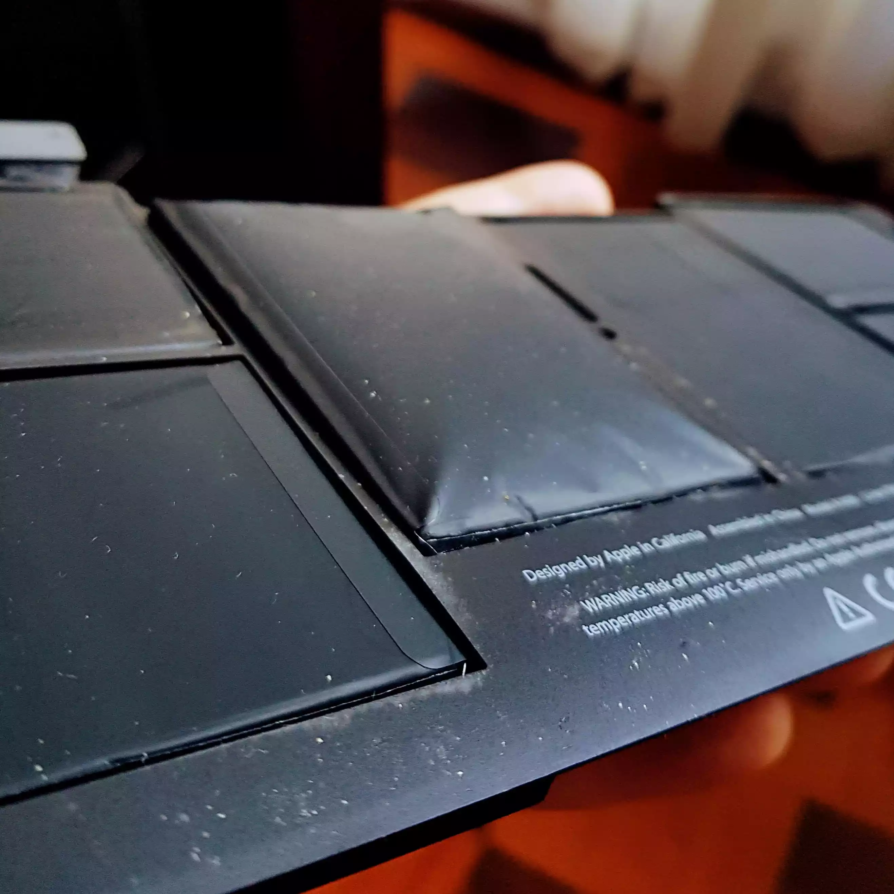
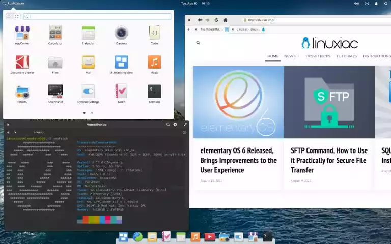
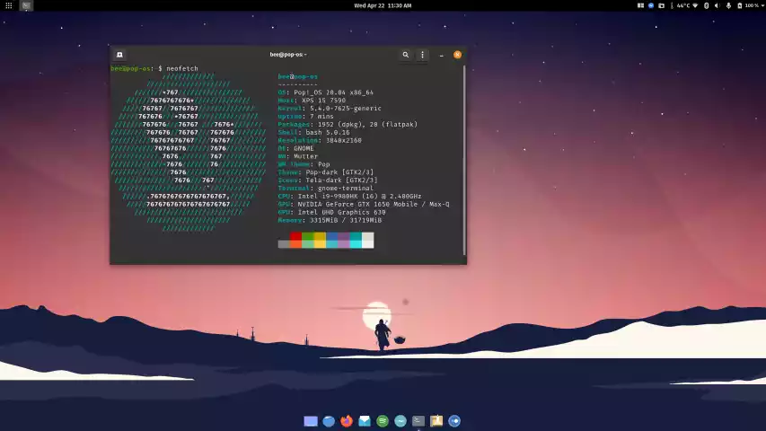
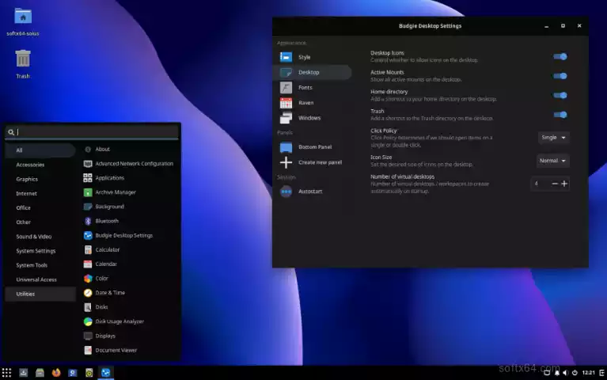
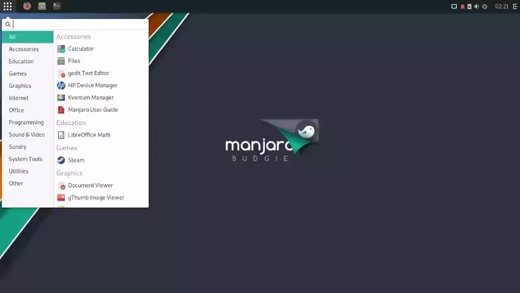

Durante toda a primeira década de 2000 eu usei Macintosh. Eles eram claramente melhores do que o Windows (e nessa época Linux nunca fora uma opção). Não foi resenhas de revistas especializadas ou comparativos que me fizeram mudar de computador. O que me convenceu foi o **barulho do disco rígido**. 

Hoje ninguém compreende como o barulho do HD podia ser irritante, ainda mais quando SSDs são a norma. Entretanto, o barulho e a vibração dos discos rígidos era um problema sério. Em um Windows PC, seu HD girava e gritava de forma descontrolada. Com o tempo você sabia até quando seu computador iria travar apenas com o barulho do HD. O problema era tão sério que estúdios de gravação colocavam os CPUs em outro lugar, bem longe da mesa e dos músicos.

Já no Macintosh tudo era diferente. O barulho do HD era mínimo, elegante, agradável, especialmente no notebook. E parecíamos destinados a compartilhar uma vida inteira juntos.

Até que o Steve Jobs morreu e o Tim Cook transformou a Apple em uma empresa mercenária. O Bill Gates de antigamente era um anjo comparado a empresa da maça hoje. 

E foi para tentar dar um propósito ao meu velho MacBook Air 2012 que voltei para o Linux.

## MacBook Air: uma máquina horrível cheia de falhas

Meu MacBook Air tinha uma configuração de respeito em 2012. Um processador i7, 4GB de ram, o máximo que podíamos comprar. Enfim, uma máquina que duraria anos, pensei. Entretanto, descobri que ela era uma porcaria.

Foi quando resolvei voltar pra o Linux e descobrir que ele poderia resolver a situação. E nem o Linux resolveu a situação. Não importava o que eu fizesse, ou qual distribuição eu usasse. 

Ele nunca foi um exemplo de desempenho, mas depois do OS X Yosemite o MacBook Air ficou impossível de usar para as tarefas mais básicas. Ficou claro depois que 4 GB de ram foi um erro e quem comprou que se vire com suas decisões. Entretanto, nunca me senti confortável de vendê-lo, porque é uma máquina com falhas graves, inclusive na bateria que incha e explode. 

E sem querer entrei na moda do *distro hopping* e conheci o mundo Linux melhor.

## As melhores distribuições para um MacBook antigo

Aula rápida para quem não sabe o que é Linux. Linux é um sistema operacional como o Windows e o macOS. Entretanto, Linux se refere ao esqueleto desse SO e você pode fazer com ele o que quiser. Então, várias pessoas colocaram "peles" diferentes em cima desse esqueleto, o que é chamado "*distribuição*".

Cada distribuição tem um propósito especifico. Algumas são voltadas para usuários avançados de Linux, outra para *gamers*, outras para quem está acostumando com o Windows, outras para quem está acostumado com o Macintosh. E a lista continua até o infinito. 

E nem por isso o trabalho foi simples ou fácil. Além de precisar conhecer essas distribuições, o hardware dos Macs trazem pegadinhas. Ou a internet sem-fio não funciona, ou o adaptador de vídeo não funciona, ou a luz do teclado não acende, ou a bateria acaba rápido demais. E a lista continua até o infinito por culpa do Tim Cook.

Entre todas, três se destacam - e por motivos diferentes. Cada um tem pontos fortes e pontos fracos. Vamos seguir a ordem cronológica de instalação do Linux no MacBook Air.

### [elementary OS](https://en.wikipedia.org/wiki/Elementary_OS) - o Linux mais bonito e ordinário

O **Linux elementay OS** é uma distro (abreviatura carinhosa de *distribuição*) visualmente igual ao macOS. Entre todas é a que enche mais os olhos. Pensada nos detalhes, o apelo visual do elementary OS é inigualável. Se você adora um Macintosh e quer dar vida nova a qualquer computador antigo da Apple, essa é a sua distro. Ou não.

Apesar do visual magistral, a cabeça-dura dos criadores do elementary OS tornam a vida de qualquer usuário normal um inferno. Eles possuem uma filosofia de software-livre radical, então nada vem instalado, nem mesmo componentes internos comuns em outras distribuições. 

Para ser minimamente útil , você precisa aprender muita coisa de Linux - até mesmo para instalar um navegador de internet decente. Ao invés de programas comuns em outras máquina, o elementary não traz nem o Firefox instalado por padrão. Sem entender bem como o Linux funciona, o elementary OS é inútil.

Aliás, até entendendo bem de Linux o elementary OS irrita. Para fazer qualquer coisa você vive instalando pacotes que já deveriam estar instalados. Portanto, você está no meio de um fluxo de trabalho e precisa de um programa simples e **ele não está instalado**. Se isso irrita "de vez enquanto", imagine precisar instalar coisas simples sistematicamente.

Além disso, o **elementary OS** não se importa muito com computadores mais antigos. Em uma maquina nova (ou com boa memória ram) sua performance é boa, mas no meu MacBook de 4GB o desempenho é bem ruim. 

### [Pop!_OS](https://en.wikipedia.org/wiki/Pop!_OS) - o Linux mais amigável

O Pop!_OS é uma distro criada pela empresa de computadores Linux **system76**. É a distribuição que vem instalada de fábrica nos computadores da empresa e uma das melhores *distros* por aí. É facil de instalar, fácil de usar, vem com uma loja de aplicativo, com drivers para sua placa NVIDIA e também tem um visual bem moderno. E é amigável para *gamers* também.

Se você procura um Linux para colocar no seu computador mais novo,  entende um pouco de Linux (ou não se importa em aprender) essa é a escolha certa - até mesmo para instalar no computador da sua mãe.

Entretanto, é uma distribuição voltada para computadores novos, portanto máquinas antigas com pouca memória não fracas demais para o Pop!_OS. Além disso, eu odeio a paleta de cores do sistema. Odeio as fontes do sistema. Para o meu fluxo de trabalho muitas coisas faltam. 

### [Solus](https://pt.wikipedia.org/wiki/Solus_(sistema_operacional)) - a melhor alternativa

Solus é uma distro baseada no modelo rolling release, ou seja, ela não tem atualizações grandes (como Windows 95, XP, VISTA, 10 e depois 11 - é Solus e pronto). Também deu origem a um novo ambiente gráfico, o Budgie Desktop. Essas duas características me chamaram a atenção e resolvi instalar no MacBook Air.

E acertei em cheio.

Durante muito tempo essa foi a distro que usei. Leve, rápida e bonita também. Pode fazer tudo que você quiser com 4GB de ram. 

Entretanto, ela era muito diferente da distro que eu escolhi como principal, o Manjaro. Então o útil e agradável. 

### [Manjaro Budgie](https://en.wikipedia.org/wiki/Manjaro) - a melhor distro para o MacBook Air

No mundo Linux existe uma distribuição chamada Arch, usada por 9,5 de 10 usuários avançados. Manjaro é uma distro Arch voltada para usuários relativamente normais, como eu. Uso ela como minha distro principal no meu computador principal.

Então resolvi testar se a união do Arch com ambiente gráfico Budgie Desktop funcionaria no MAcBook Air.

E sim, funcionou. Leve, rápida e bonita também. Pode fazer tudo que você quiser com 4GB de ram.

O Manjaro Budgie ressuscita um MacBook Air antigo. 

E quem chegou até o fim desse texto não precisa de maiores explicações de como instalar e usar um Linux funciona. 

Mas e quem não entende de Linux e possui um MacBook Air antigo por ai, faz o quê?

Vamos à conclusão.

## Conclusão

Instalar o Linux em Macintosh, ainda mais MacBooks, tem seus percalços. Mas é possível e os resultados são bons. Se quer ressuscitar um MacBook antigo com o Linux, o Manjaro Budgie é a melhor opção.

Entretanto, se você não precisa do Linux no seu MacBook antigo, há uma opção ainda melhor: **Chrome OS**.

É sério. Nenhuma distribuição Linux chegou aos pés do Chrome OS em termos de usabilidade, performance e fluidez nos meus testes. 

Portanto, se quiser usar seu MacBook Air antigo, a melhor coisa que você faz é transformar ele num ChromeBook. Tudo funciona, a bateria dura uma eternidade e há aplicativos para qualquer coisa na Google Store. 

Vai ser feliz e esqueça a Macintosh. Por mais fantástico que seja a Apple e o novíssimo chip M1, Tim Cook fará seu MacBook ficar obsoleto em cinco anos. Disso eu não tenho dúvidas.

PS: Como algumas pessoas se irritaram com o texto, segue um [follow-up](/p/um-follow-sobre-linux-macos-windows/)
