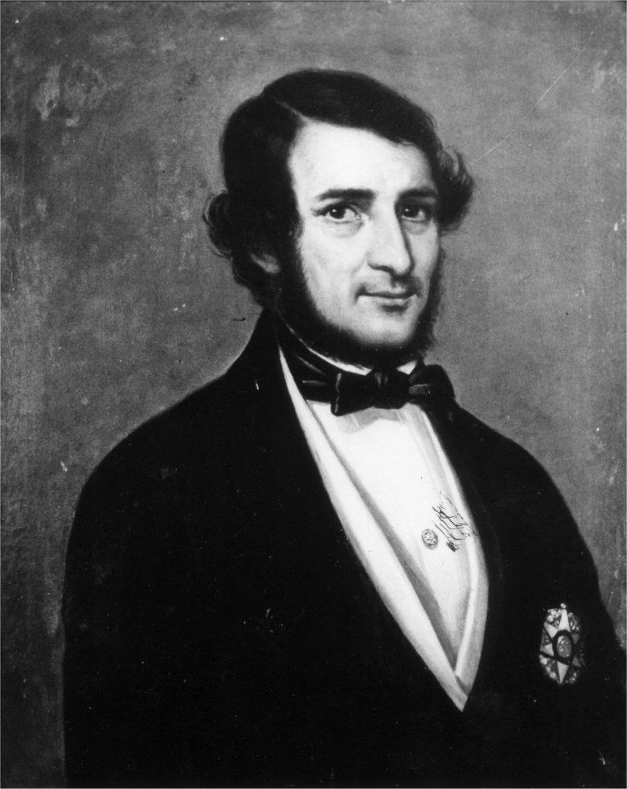

Em 1890, Rui Barbosa decidiu queimar todos os arquivos da escravidão no Brasil. Durante anos, esse ato esteve diretamente ligado a uma suposta tentativa do Ministro em tentar destruir registros da escravidão. Ingênua opinião.

> "Nos primeiros anos da República, o Ministro da Fazenda Rui Barbosa mandou destruir as cópias das matrículas e registros de propriedade de escravos. Com esta medida, provavelmente, ele eliminaria as provas da posse anterior de escravos, dificultando ações que reivindicassem, perante o governo, a indenização da propriedade perdida com a abolição." 
> 
> <cite>(Adaptado de Robert Slenes, "Escravos, cartórios e desburocratização: o que Rui Barbosa não queimou será destruído agora?", Revista Brasileira de História, v. 5, n. 10, mar.-ago., 1985, p. 169.) </cite>

Mas a fogueira desmiolada de Rui transformou em pó não só a dívida do Governo Brasileiro, mas também fontes preciosas para entender a formação da cultura brasileira (talvez, por essas e outras, nunca conseguimos uma Cultura, somente o pseudo-cultural que infesta as estantes, salas de aulas e discursos políticos).Mesmo assim, vários documentos sobreviveram para relatar o período escravista. Muito se fala dos negros, de sua situação de escravos, arrancados de sua terra natal, submetido a péssimas condições de trabalho, sendo as mulheres estupradas pelos senhores de engenho, os negros fornicando com as sinhás, famílias desmembradas por negócios comerciais. Enfim, tudo que ronda a imaginação do brasileiro sobre o tema.

*Resgate: Uma Janela Para os Oitocentos*, (TopBooks, 1995), não poderia ter um nome mais propício. Através da história da Fazenda do Resgate, propriedade da família Vallim, a **Dra. Hebe Maria Mattos de Castro** (UFF) e o pesquisador e historiador **Eduardo Schnoor** (PUC-RJ) organizaram um livro que se abre para esta época perdida. Nos limites dos mourões da Fazenda do Resgate, sintetiza-se a história (muito mal contada por aí) do fim da escravidão no Brasil. Observando a vida do Comendador Manoel de Aguiar Vallim, acha-se a tentativa individual de migrar de uma economia em declínio para uma modernidade iminente.

O livro se divide em sete ensaios. Dois deles pertencentes aos profissionais já citados. Os outros são: **Dra. Sheila de Castro Faria**, **Dra. Ana Maria Maurd Essus** e **José Roberto Góes**, da Universidade Federal Fluminense; **Martha Abreu, UFF/UNICAMP**; **Dr. Manolo Florentino** e **João Luís Fragoso**, da UFRJ; e por fim, **Ana Maria Lugão Rios**, doutoranda na Universidade de Minnesota.

A Família Vallim teve importante papel, preservando o seu passado, o que possibilitou aos pesquisadores acesso a material sem igual para a realização do trabalho. Além de fotografias, artigos de jornais da época e, principalmente, a documentação do Comendador Manoel Aguiar Vallin.

Ele é o personagem principal. Fazendeiro, político, senhor de escravos, o Comendador Vallim construiu uma fortuna inigualável, multiplicando por dez o que herdou dos pais - "ao morrer detinha 1% do PIB nacional". Mas o livro discorre desde os casamentos da época, com nítida função de ascensão política, social e econômica, o papel desta nova invenção - a fotografia - na elite brasileira, os escravos e sua complexidade e a empresa no séc. XIX.

Até aqui, tudo igual. O que torna a obra interessante é o fato dela desmistificar o que nos é tido como verdade. Por exemplo, as alianças matrimoniais não eram vistas como um sacrifício dos filhos. Muito pelo contrário, era prática comum e essencial. "Não deixavam de ser uma reciprocidade". Nem mesmo o romantismo, o "casamento-higiênico" - i.e., entre não parentes - tiveram efeito imediato: *"...principalmente porque os que tinham acesso à leitura e ao conhecimento destes temas eram os das famílias principais, justo as mais cuidadosas nas alianças."*

Outro ponto importante são os escravos e a vida na senzala. De uma complexidade maravilhosa, os negros vindo da África conseguiram continuar com a sua sociedade, inclusive com as brigas entre as tribos originais. Essa tensão constante dentro da vida escrava é detalhe que passa desapercebido na história hoje contada. Citação no livro:

> "A população negra é composta de oito ou nove castas diferentes, que não têm um linguagem comum nem são ligadas umas às outras por nenhum laço, a tal ponto que freqüentemente elas se emprenham em lutas e batalhas, das quais chegam a participar até duzentos indivíduos de uma nação de cada lado. Os brancos incentivam essa animosidade, procurando mantê-la vida, por acharem que ela está intimamente associada à sua própria segurança." 
> 
> <cite>(WALSH)</cite>

Novidade ver as reivindicações dos negros revoltosos, como no caso de um grupo que fugiu de seu senhor e mandou uma carta para selar um acordo de paz (raridade, há pouca documentação escrita pelos escravos). Nela, pediam em troca da volta pacífica à fazenda, entre outras coisas, *"melhores condições de trabalho, a oportunidade de cultivarem gêneros alimentícios e de comercializá-los, mais conforto material e o direito de 'brincar, folgar e cantar', quando lhes conviessem"*. Entretanto, a peculiaridade era os revoltosos reivindicarem a separação deles dos "Minas", etnia rival. *"Não nos há de obrigar a fazer camboas, nem a mariscar (...) mande seus pretos Minhas."*

É, realmente a paciência dos escravos tinha limites.

**UM EMPRESÁRIO BRASILEIRO DOS OITOCENTOS?**

O Comendador Manoel Aguiar Vallim foi um típico fazendeiro da época de ouro do café no leste paulista. Representante da elite econômica, conservador e defensor do escravismo, lutou contra as leis abolicionistas, mas morreu dez anos antes da assinatura da Lei Áurea. Entretanto, homem de visão, previu com vinte anos de antecedência o fim desse sistema e, ao invés de lamentar, modernizou-se. Apesar de na época de sua morte a fazenda (portanto, a força escrava) representar 60% dos seus rendimentos, Vallim partiu para outros negócios, como a compra de títulos da dívida pública, até mesmo títulos americanos.

Uma luta entre os empresários dependentes do escravo e de uma elite intelectual ansiosa pelo novo modismo: a liberdade. Problema eterno brasileiro: o modismo. Até mesmo durante sua luta contra os abolicionistas, Vallim partia do bom-senso. *"É um erro, é um mal, erro e mal de conseqüências incalculáveis, a extinção imediata e completa da escravidão..."*, dizia em artigo publicado no *Diário do Rio de Janeiro*, em 1871:

> Existe a escravidão: é um fato filosoficamente lamentável, mas é um fato (...) 
> Nem se trata aqui como na França, Inglaterra, na Espanha de um assunto colonial; a instituição escrava acha-se entranhada no âmago da nação, influindo em todas as suas vísceras. Se naqueles países não se dispensaram as grandes medidas preparatórias para chegar a emancipação, de maior vulto se torna essa necessidade para nós.(...) 
> Reformas como esta de que se trata não se operam somente com os simples artigos de uma lei: para consegui-las e fundá-las é necessário animar o trabalho, educar o povo e fiar um pouco o espírito do século acordando-o em suas generosas tendências.

Se naquela época podiam ou não calcular o efeito do fim da abolição, não importa. Fato é que hoje estamos a pagar essa conta. Não é defender a escravidão, mas saber ao menos o que sabe Ênio Mainardi: **Olha, em se tratando de Brasil, somos todos negros.**

[Resgate: uma janela para os oitocentos](http://www.labhoi.uff.br/node/457)

Texto Publicado em 06 de março de 2005.