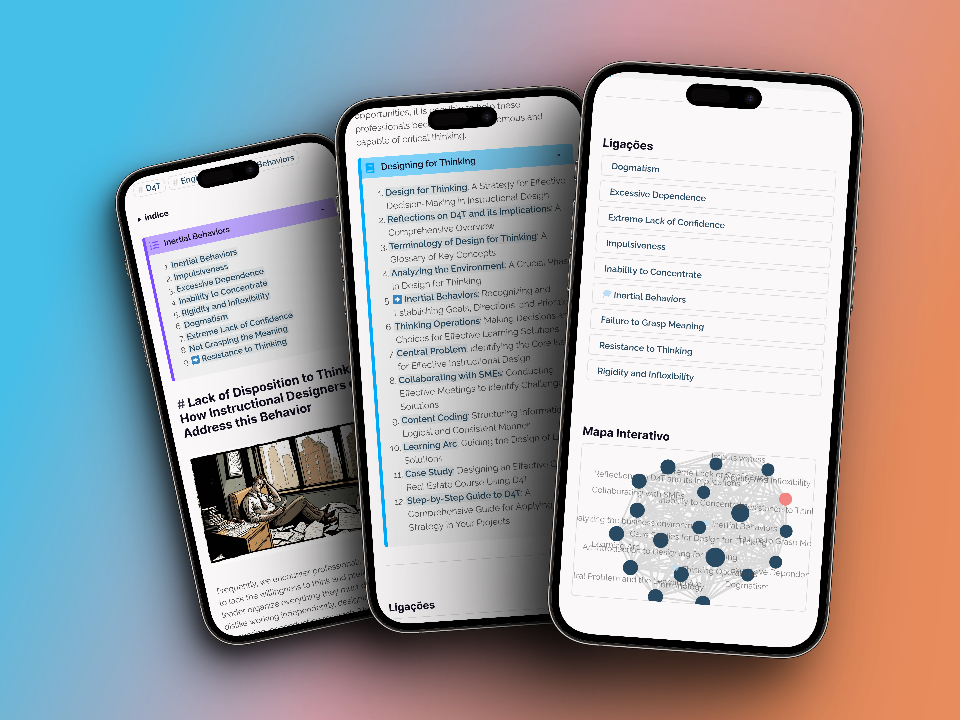
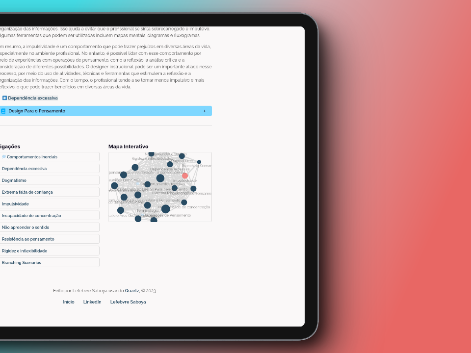
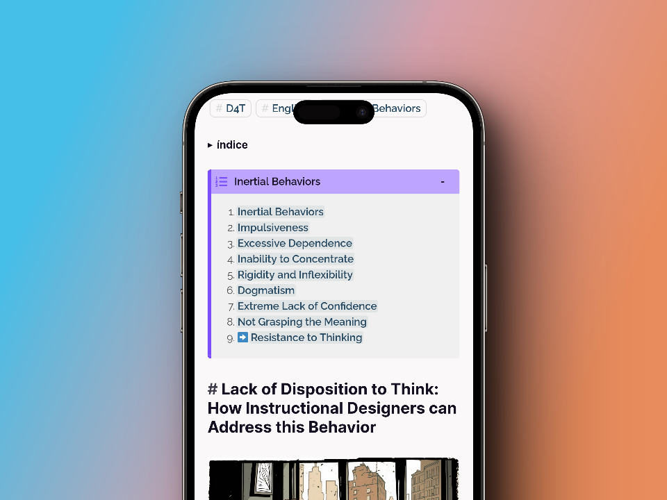
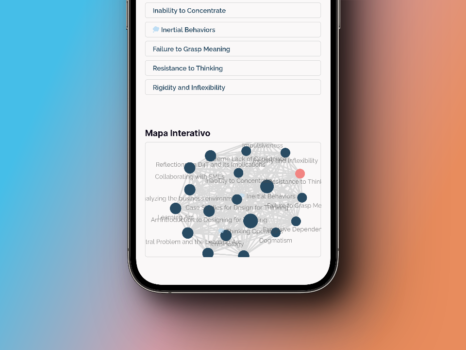





# D4T - Digital Garden de Design Instrucional

O D4T fornece uma coleção selecionada de informações e recursos para educadores e designers instrucionais.






O objetivo principal do site é disseminar novas ideias e servir como um repositório de informações sobre design instrucional em português. O site deve permitir o fácil acesso e navegação das informações, bem como apresentar conteúdo de forma orgânica e interconectada.


 
- **Objetivo**: Disseminar ideias e informações sobre design instrucional .
- **Público-alvo**: Educadores, designers instrucionais, estudantes, pesquisadores etc.
- **Estrutura**: Organizado em categorias e subcategorias relacionadas ao tema.
- **Formato**: Digital Garden, com conteúdo interconectado.
- **Plataforma**: Site desenvolvido com o Hugo.
- **Idioma**: Português e Inglês.
- **Ferramentas**: Hugo, Markdown, Git, Github.
 



## 1. Definição do objetivo e escopo

Criar um site com foco em design instrucional usando o conceito de **Digital Garden**. O termo refere-se a uma abordagem pessoal e não-linear para criar, organizar e compartilhar ideias, conhecimentos e informações na web. Um jardim digital (digital garden) é uma espécie de espaço online onde os indivíduos cultivam seus pensamentos e ideias, assim como um jardineiro cuida de seu jardim.

Em vez de se concentrar em conteúdo perfeitamente elaborado e definitivo, como em blogs e artigos, os jardins digitais se concentram na evolução e no crescimento constante do conhecimento. As informações e ideias são apresentadas de maneira mais orgânica e interconectada, permitindo que os visitantes explorem e sigam seu próprio caminho pelo conteúdo.

Os jardins digitais geralmente contêm anotações, esboços, rascunhos, reflexões e até mesmo conteúdo multimídia, como fotos, vídeos e áudio. Eles são projetados para evoluir e mudar com o tempo, à medida que o autor aprende e amadurece em seu pensamento e compreensão.

Os jardins digitais são uma maneira de compartilhar conhecimento e inspiração, promovendo a aprendizagem contínua, o pensamento crítico e a curiosidade. Além disso, incentivam a colaboração e a troca de ideias entre os indivíduos, criando um ambiente de aprendizagem dinâmico e enriquecedor.

### 1.1. Objetivo principal:

O objetivo principal do site é servir como uma plataforma para compartilhar teorias, ideias e conhecimentos sobre design instrucional, além de ser um repositório de informações úteis para aqueles que buscam aprender ou aprimorar suas habilidades nessa área. O site deve oferecer uma experiência de usuário agradável e interativa, incentivando a exploração e a descoberta de novos conceitos e conexões.

Como o design instrucional é uma área em constante evolução, é importante estar atualizado com as tendências e pesquisas mais recentes. Muitas vezes, essas tendências e pesquisas são apresentadas em conferências internacionais, publicações acadêmicas em inglês e outros materiais que não são facilmente acessíveis para os profissionais em design instrucional no Brasil.

Além disso, a tradução desses materiais também pode permitir uma maior colaboração internacional e uma troca de ideias e práticas com outros profissionais em design instrucional em todo o mundo. Isso pode enriquecer a prática e trazer novas perspectivas e soluções para desafios na área.

Ao traduzir esses conteúdos, também se está contribuindo para a construção de uma comunidade de design instrucional mais inclusiva e acessível, permitindo que mais profissionais tenham acesso às informações e conhecimentos necessários para aprimorar suas práticas e impulsionar o avanço da área no Brasil.

### 1.2. Público-alvo:

O público-alvo do site são educadores, designers instrucionais, estudantes, pesquisadores e outros profissionais interessados em design instrucional. Compreender as necessidades e expectativas do público-alvo ajudará a moldar o conteúdo e a estrutura do site.

### 1.3. Escopo do conteúdo:

Escopo do conteúdo a ser incluído no site deve envolver a identificação de tópicos e subáreas dentro do design instrucional que enfrentam dificuldades na incorporação no desenvolvimento profissional dos designers instrucionais brasileiros. Essas lacunas existem por uma série de razões, incluindo barreira linguística, limitações de recursos, falta de incentivo, acesso limitado à informação e dificuldades de implementação. 

Para superar essas barreiras, é importante investir em programas de formação e incentivar a atualização constante da prática, bem como garantir o acesso a informações e recursos necessários para incorporar novas pesquisas e tendências na prática de design instrucional, com especial foco nas seguintes áreas:

-   Teorias de aprendizagem e modelos pedagógicos
-   Estratégias e técnicas de ensino    
-   Design de cursos e planejamento    
-   Avaliação e feedback    
-   Tecnologia educacional e ferramentas de ensino    
-   Tendências e inovações em design instrucional    
-   Estudos de caso e exemplos práticos    

A falta de agilidade na incorporação de pesquisas internacionais no desenvolvimento profissional dos designers instrucionais brasileiros pode ter várias razões. Algumas delas podem incluir:

1. Barreira linguística: Como muitas pesquisas e publicações acadêmicas sobre design instrucional são em inglês, isso pode ser uma barreira para muitos profissionais no Brasil que não falam o idioma. Isso pode limitar o acesso a informações importantes e atrasar a incorporação de novas pesquisas e tendências.    
2. Limitações de recursos: Os profissionais em design instrucional no Brasil podem enfrentar limitações de recursos, como falta de acesso a materiais e tecnologias necessárias para implementar novas práticas e tendências.    
3. Falta de incentivo: Muitas vezes, a falta de incentivo por parte de instituições educacionais e empresas pode ser uma barreira para a incorporação de novas pesquisas e tendências. Se as instituições não valorizam a atualização e o aprimoramento constante da prática de design instrucional, isso pode desencorajar os profissionais a investirem tempo e recursos na incorporação dessas pesquisas.    
4. Acesso limitado à informação: O acesso limitado à informação pode ser outra razão para a falta de agilidade na incorporação de pesquisas internacionais no desenvolvimento profissional dos designers instrucionais brasileiros. Isso pode incluir a falta de acesso a conferências internacionais, publicações acadêmicas e outras fontes importantes de informação.    
5. Dificuldades de implementação: Algumas novas pesquisas e tendências em design instrucional podem ser difíceis de implementar na prática, o que pode atrasar a incorporação dessas pesquisas pelos profissionais no Brasil.

### 1.4. Estrutura e navegação:

A estrutura geral do site e  do conteúdo será organizado para facilitar a navegação e a descoberta. Para isso foi preciso pensar em como categorizar e conectar informações de maneira orgânica e interconectada, para que os usuários possam explorar facilmente o conteúdo e seguir seu próprio caminho de aprendizado. Decidimos utilizar categorias, tags, backlinks e outros mecanismos de navegação.



### 1.5. Cronograma e recursos:

Foi preciso estabelecer um cronograma realista para o desenvolvimento e lançamento do site, considerando aspectos como pesquisa, design, desenvolvimento, implantação e promoção. Identificamos também os recursos necessários para o projeto, como ferramentas, colaboradores e orçamento.

Ao definir o objetivo e o escopo do projeto desde o início, tentamos estabelecer uma base sólida para o desenvolvimento de um site de jardim digital bem-sucedido focado em design instrucional. Isso também ajudou a orientar as decisões futuras relacionadas ao design, conteúdo e funcionalidades do site.

## 2. Estrutura de conteúdo:

Ao criar um site de jardim digital focado em design instrucional, é essencial estruturar o conteúdo de maneira apropriada para facilitar a navegação e a descoberta, bem como promover a conexão orgânica entre ideias e informações. Aqui está uma descrição detalhada desse processo.

### 2.1. Categorias e subcategorias:

Organizar o conteúdo em categorias e subcategorias relacionadas ao design instrucional, para que os visitantes possam facilmente identificar e acessar informações relevantes. Algumas categorias e subcategorias potenciais incluem:

-  Teorias de aprendizagem: Behaviorismo, Cognitivismo, Construtivismo, Conectivismo.    
-  Metodologias: Instrução direta, Aprendizagem baseada em projetos, Aprendizagem invertida (Flipped Classroom), Sala de aula híbrida.    
-  Ferramentas: Sistemas de gerenciamento de aprendizagem (LMS), Ambientes virtuais de aprendizagem (VLE), Ferramentas de autoria, Ferramentas de colaboração.    
-  Estudos de caso: Exemplos de sucesso, Lições aprendidas, Estudos comparativos.    
-  Tendências: Aprendizagem personalizada, Microaprendizagem, Aprendizagem baseada em competências, Realidade virtual e aumentada.   
-  Recursos: Livros, artigos, cursos, eventos, blogs e sites relacionados.    

### 2.2. Páginas de índice:

Para cada categoria e subcategoria terá uma página de índice que lista o conteúdo relacionado. Essas páginas de índice devem servir como pontos de entrada para os visitantes explorarem os tópicos em mais detalhes. Consideramos adicionar recursos visuais, como gráficos e imagens, para tornar as páginas mais atraentes e informativas, sempre com o foco na facilidade do aprendizado. 

### 2.3. Tags e conexões:

Usamos tags para conectar e inter-relacionar o conteúdo de diferentes categorias e subcategorias. Por exemplo, um artigo sobre a aplicação da teoria construtivista em um ambiente de aprendizagem online pode ser marcado com as tags "Construtivismo" e "Ambientes virtuais de aprendizagem". Isso facilita a descoberta de conteúdo relacionado e ajuda os visitantes a estabelecer conexões entre ideias e informações.

### 2.4. Backlinks e referências:

Incorporamos backlinks e referências ao longo do conteúdo, de modo que os visitantes pudessem seguir os links para explorar tópicos relacionados e aprofundar seu conhecimento. Isso promove a interconexão orgânica entre as ideias e permite que os visitantes sigam seu próprio caminho de aprendizado através do jardim digital.



### 2.5. Conteúdo em evolução:

Um jardim digital é um espaço em constante evolução. Ao adicionar e atualizar o conteúdo, continuamos refinando e ajustando a estrutura do site para acomodar novas informações e conexões. Quando necessário podemos usar um sistema de controle de versão, como o Git, para rastrear mudanças e colaborar com outros contribuidores.

### 2.6. Blocos de anotações e reflexões:

Tentamos incluir blocos de anotações e reflexões ao longo do conteúdo para compartilhar ideias, pensamentos e experiências relacionadas ao design instrucional. Isso humaniza o conteúdo e ajuda a estabelecer uma conexão emocional com os visitantes, além de demonstrar que o jardim digital é um espaço para aprendizado e crescimento contínuo.

### 2.7. Navegação não linear:

Encorajamos a navegação não linear através do conteúdo, permitindo que os visitantes explorem o jardim digital de acordo com seus interesses e necessidades. Incluímos um mapa do site visual,  uma visualização de gráfico de conhecimento que mostra as conexões entre os tópicos e ajuda os visitantes a navegar pelo conteúdo.

## 3. Estrutura do site

### 3.1. Página inicial

Embora o Markdown seja uma linguagem de marcação leve e fácil de usar, ela tem limitações em termos de design e funcionalidade, especialmente ao criar uma landing page que requer recursos de webdesign mais avançados. 

Essa é uma versão simplificada de uma landing page em Markdown, com seções e links para as categorias e subcategorias mencionadas anteriormente, bem como links para os últimos textos e uma imagem representando a teia de conexões entre os conteúdos. Para capturar a atenção do usuário, a página inclui uma descrição clara do propósito do site e um convite para explorar o conteúdo relacionado. 

A criação de landing pages secundárias ou páginas de índice pode ser útil para aprofundar em cada tópico e proporcionar uma navegação mais fácil e organizada. No entanto, é importante lembrar que essa implementação em Markdown não oferece todas as possibilidades de design e interatividade encontradas em uma solução completa baseada em HTML, CSS e JavaScript.


```md
# Jardim Digital de Design Instrucional 🌿📚

**Explore** um mundo de informações baseadas em evidências e novas ideias para enriquecer suas práticas e estratégias educacionais.

## 🌟 O que esperar em nosso Jardim Digital

1. [Teorias de Aprendizagem](teorias-de-aprendizagem.md)
2. [Metodologias Inovadoras](metodologias.md)
3. [Ferramentas Tecnológicas](ferramentas.md)
4. [Estudos de Caso Inspiradores](estudos-de-caso.md)
5. [Tendências Emergentes](tendencias.md)
6. [Recursos Valiosos](recursos.md)

## 🌱 Cultive seu conhecimento com nossos últimos textos

- [Desvendando Mitos da Aprendizagem](desvendando-mitos.md)
- [Design Instrucional e Gamificação](gamificacao.md)
- [Inteligência Artificial na Educação](inteligencia-artificial.md)

## 🔍 Descubra as conexões em nosso Jardim

[](mapa-do-jardim.md)

Navegue pelo mapa interativo de nosso Jardim Digital e explore as conexões entre os diferentes tópicos e conteúdos.

## 💌 Fique por dentro das novidades

Receba atualizações sobre novos conteúdos, eventos e recursos em primeira mão. Assine nossa newsletter e conecte-se ao nosso Jardim Digital.

[Assinar Newsletter](newsletter.md)

## 💡 Entre em contato conosco

Tem alguma dúvida, sugestão ou deseja contribuir com o nosso Jardim Digital? Adoraríamos ouvir você.

[Fale conosco](contato.md)
```

Essa versão da landing page em Markdown busca ser mais criativa, incluindo emojis para adicionar um toque visual e amigável à página. As seções e links foram organizados de maneira ligeiramente diferente para melhorar a legibilidade. A descrição do propósito do site e os convites para explorar o conteúdo relacionado permanecem, e o mapa interativo é apresentado como uma forma de incentivar a exploração das conexões entre os tópicos. 

### 3.2. Organização de diretórios

A seguir precisávamos definir uma estrutura de diretórios para o conteúdo do site Jardim Digital de Design Instrucional. Nesta estrutura, cada categoria tem sua própria pasta com um arquivo `_index.md` que serve como a página principal da categoria. Os arquivos Markdown dentro de cada pasta representam páginas individuais para os tópicos relacionados à categoria. Além disso, há pastas para as páginas "Sobre", "Contato", "Newsletter" e "Mapa do Jardim" que também possuem arquivos `_index.md`.

```md
/content
|-- teorias-de-aprendizagem
|   |-- _index.md
|   |-- behaviorismo.md
|   |-- cognitivismo.md
|   |-- construtivismo.md
|   |-- conectivismo.md
|-- metodologias
|   |-- _index.md
|   |-- aprendizagem-invertida.md
|   |-- aprendizagem-baseada-em-projetos.md
|   |-- aprendizagem-colaborativa.md
|-- ferramentas
|   |-- _index.md
|   |-- plataformas-lms.md
|   |-- ferramentas-de-autoria.md
|   |-- aplicativos-educacionais.md
|-- estudos-de-caso
|   |-- _index.md
|   |-- gamificacao-no-ensino-superior.md
|   |-- inteligencia-artificial-na-educacao.md
|-- tendencias
|   |-- _index.md
|   |-- aprendizagem-adaptativa.md
|   |-- microlearning.md
|   |-- aprendizagem-movel.md
|-- recursos
|   |-- _index.md
|   |-- livros.md
|   |-- artigos.md
|   |-- cursos.md
|-- sobre
|   |-- _index.md
|-- contato
|   |-- _index.md
|-- newsletter
|   |-- _index.md
|-- mapa-do-jardim
|   |-- _index.md
```

## 4. Criação de conteúdo

Levando em consideração a necessidade de manter o conteúdo atualizado e baseado em evidências, além de garantir que as informações mais recentes sejam acessíveis aos profissionais, aqui está a estratégia detalhada para a criação de conteúdo para o site:

1. **Monitoramento de fontes relevantes**: Mantenha-se atualizado com as últimas pesquisas e descobertas em design instrucional, acompanhando publicações acadêmicas, blogs, podcasts, conferências e outros recursos relevantes. Dê preferência às fontes confiáveis e respeitadas na área.    
2. **Estabeleça parcerias com especialistas e instituições**: Conecte-se com especialistas, acadêmicos e instituições de pesquisa envolvidas no campo do design instrucional. Isso pode ajudá-lo a acessar informações e pesquisas atualizadas, além de colaborar na criação e revisão de conteúdo.    
3. **Tradução e adaptação de conteúdo**: Para tornar as informações mais acessíveis aos profissionais brasileiros, traduza e adapte o conteúdo relevante do inglês para o português. Certifique-se de que as traduções sejam precisas e de alta qualidade e, quando necessário, adapte exemplos e contextos para refletir a realidade local.    
4. **Criação de conteúdo original**: Desenvolva conteúdo original abordando tópicos relevantes para o design instrucional no contexto brasileiro. Isso pode incluir estudos de caso locais, análises de políticas educacionais, entrevistas com especialistas e profissionais locais, entre outros.    
5. **Revisão e atualização regular do conteúdo**: Estabeleça um cronograma para revisar e atualizar o conteúdo do site regularmente. Isso garantirá que as informações sejam precisas e reflitam as descobertas e práticas mais recentes. Inclua também informações sobre a data da última atualização, para que os visitantes saibam o quão atual é o conteúdo.    
6. **Inclusão de referências e fontes**: Ao criar conteúdo, inclua referências e links para as fontes originais das informações e pesquisas citadas. Isso permitirá que os visitantes acessem e verifiquem as informações por si mesmos e explorem os tópicos em maior profundidade.    
7. **Facilitar o feedback e a contribuição da comunidade**: Encoraje os visitantes a fornecer feedback e contribuir com o conteúdo do site. Isso pode incluir a solicitação de sugestões, correções e atualizações, bem como a criação de oportunidades para os visitantes compartilharem suas próprias experiências e conhecimentos.    
8. **Promover a colaboração e o compartilhamento de informações**: Estabeleça um espaço no site para a comunidade de profissionais brasileiros de design instrucional se conectar, compartilhar recursos e discutir ideias e práticas baseadas em evidências. Isso pode incluir um fórum de discussão, uma lista de e-mails ou uma plataforma de mídia social.
9. **Estabelecer um cronograma de publicação**: Para manter o conteúdo do site atualizado e envolver os visitantes, estabeleça um cronograma regular de publicação de novos artigos, recursos e atualizações. Isso pode incluir, por exemplo, publicar um novo artigo a cada semana ou quinzenalmente.    
10. **Divulgar o conteúdo**: Para aumentar o alcance e o impacto do conteúdo do site, desenvolva estratégias para divulgá-lo para profissionais e instituições relevantes. Isso pode incluir o uso de mídias sociais, newsletters, parcerias com organizações e participação em eventos e conferências.    
11. **Avaliar o impacto do conteúdo**: Monitore e avalie o impacto do conteúdo do site, utilizando métricas como visualizações de página, compartilhamentos, comentários e feedback dos visitantes. Use essas informações para refinar sua estratégia de criação de conteúdo e garantir que você esteja atendendo às necessidades e interesses do seu público-alvo.    
12. **Capacitação e desenvolvimento contínuo**: Invista em sua própria capacitação e desenvolvimento profissional, participando de cursos, workshops, conferências e outras oportunidades de aprendizado. Isso ajudará a garantir que você esteja atualizado com as últimas tendências e práticas no campo do design instrucional e seja capaz de aplicá-las ao conteúdo do site.    

Ao seguir essa estratégia detalhada, acreditamos que o site será um recurso valioso para educadores, designers instrucionais, estudantes, pesquisadores e outros profissionais interessados em design instrucional no Brasil. Ao se concentrar em informações baseadas em evidências e na relevância local, o site tenta contribuir para o desenvolvimento e a disseminação de práticas eficazes no campo do design instrucional, beneficiando tanto os profissionais quanto os alunos.




## 5. Ferramentas 

Essas ferramentas e softwares podem variar dependendo das necessidades específicas do projeto, da equipe e do fluxo de trabalho. É importante escolher as ferramentas que melhor se ajustem às suas necessidades e que permitam uma colaboração e um fluxo de trabalho eficientes.

| Ferramenta        | Descrição                                                             |
|-------------------|-----------------------------------------------------------------------|
| Hugo              | Para construir e gerenciar o site                                     |
| Markdown          | Para escrever e formatar o conteúdo do site                           |
| Git               | Para controle de versão e colaboração                                 |
| GitHub ou Netlify | Para hospedagem do site                                               |
| Visual Studio Code| Editor de código-fonte para escrever e editar arquivos de código      |
| Google Analytics  | Para rastreamento e análise do tráfego do site                        |
| SEO tools         | Ferramentas como Moz, SEMRush ou Google Search Console para SEO       |
| Trello ou Asana   | Para gerenciamento de projetos e organização de tarefas               |
| Canva             | Para criação de gráficos e imagens para o site, como banners, thumbnails, infográficos etc. |
| Slack ou Discord | Para comunicação e colaboração em tempo real com a equipe             |
| Google Docs      | Para colaboração em documentos e planejamento de conteúdo            |
| Feedly           | Para acompanhar blogs e sites relevantes e se manter atualizado com as últimas tendências e pesquisas em design instrucional | 




