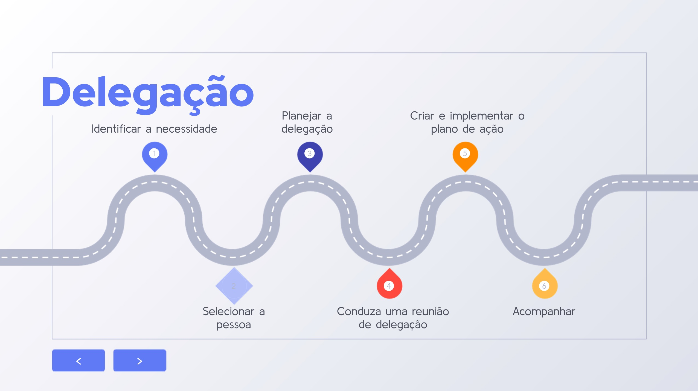
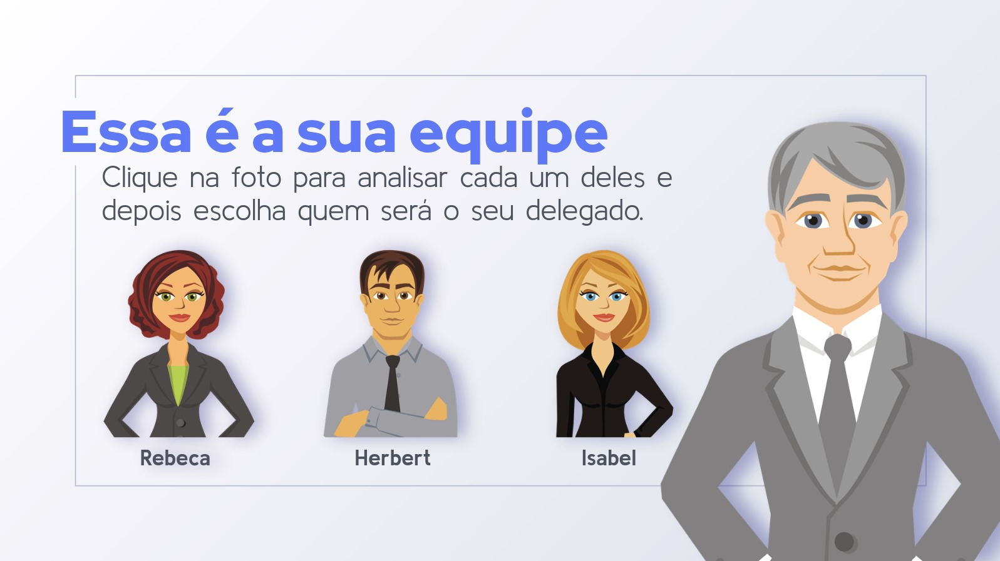
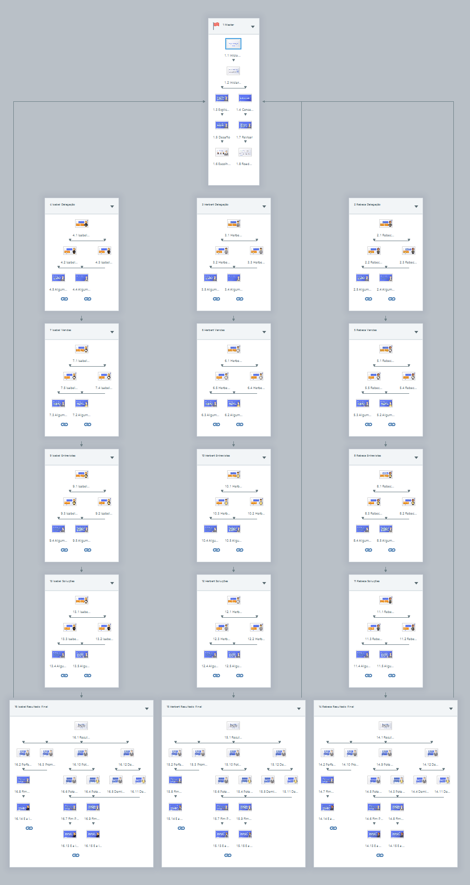



#  Projeto: Liderança e Delegação
## Experiência de eLearning Baseada em Cenários





Bom, se você está aqui para aprender sobre "Liderança e Delegação", vamos cortar o excesso e ir direto ao assunto. Este não é um daqueles cursos cheios de frufrus e teorias sem sentido. Este é um projeto prático, destinado a líderes reais que enfrentam desafios reais no mundo corporativo - um mundo que, francamente, não tem tempo para enrolação.

No "Liderança e Delegação", focamos em habilidades que realmente importam: identificar quem merece ser promovido e delegar tarefas de maneira eficiente. Nada de conversa fiada, apenas resultados. Usamos uma abordagem baseada em cenários - e quando digo cenários, me refiro a simulações realistas, não a fantasias. Cada decisão que você toma nesse curso tem um peso, assim como no trabalho de verdade.


- **Título**: Liderança e Delegação
- **Data de Lançamento**: 15 de agosto de 2022
-  **Stakeholders**:
   - Diretores da Empresa
   - Especialistas no Assunto (SMEs)
   - Equipe de Design Instrucional
   - Aprendizes (Gerentes e Supervisores)
- **Público-Alvo**: Líderes corporativos (diretores, gerentes, supervisores)
- **Ferramentas Utilizadas**: Articulate Storyline, Microsoft Powerpoint, Scrivener, Outliner
- **Meu Papel**: Líder de projeto – responsável pela análise e diagnóstico de performance, estruturação do curso, coordenação com SMEs e desenvolvimento de conteúdo.
  



## Processo de Desenvolvimento

### Fase 1: Análise de Necessidades e Planejamento:

O projeto iniciou com uma análise detalhada das necessidades da organização, focando em melhorar a eficácia da delegação entre líderes. Utilizamos o **Mapa de Ação** para revisar treinamentos anteriores e conduzir entrevistas com diretores e SMEs. Identificamos a necessidade de uma abordagem mais prática e aplicável da teoria da delegação.

- **Consulta Inicial:** Colaboração com diretores da empresa e especialistas no assunto (SMEs) para entender o cenário de liderança e histórico de treinamento.
- **Definição de Objetivos:** Identificação de dois objetivos principais: aprimorar o processo de delegação e melhorar a identificação de candidatos internos para promoções.
- **Análise de Lacunas:** Revisão aprofundada dos programas de treinamento existentes para determinar por que eles não produziram os resultados desejados na aplicação prática.

#### Objetivos do Projeto:

1. Aprimorar a competência dos líderes no processo de delegação.
2. Desenvolver habilidades para identificar membros da equipe aptos a promoções.

### Fase 2: Estratégia de Design Instrucional

Decidimos por uma experiência de eLearning baseada em cenários, complementada por materiais informativos sobre delegação. A ênfase estava em criar um ambiente realista, promovendo uma aplicação prática da teoria.

Usando o Articulate Storyline, criamos cenários de delegação onde cada decisão do aluno influencia o desfecho. Implementamos um sistema de feedback detalhado, que reflete as escolhas do aluno, proporcionando uma compreensão profunda do impacto de suas decisões. Este sistema foi a peça central do projeto, diferenciando-o por sua abordagem realista e consequências variáveis.

- **Desenvolvimento de Cenários:** Criação de cenários realistas de delegação que imitam desafios complexos de liderança na vida real, oferecendo experiências práticas de aprendizado situacional.
- **Desenvolvimento de Conteúdo:** Curadoria e criação meticulosa de conteúdo que mescla conhecimento teórico com aplicações práticas, incluindo materiais de fundo e guias para apoiar os cenários de eLearning.

### Fase 3: Desenvolvimento de Cenários Interativos e Sistema de Feedback

O sistema de feedback era projetado para fornecer insights imediatos sobre cada escolha feita pelos alunos. Se uma decisão correta era tomada, o feedback reforçava por que a ação era adequada. Em contraste, escolhas incorretas eram acompanhadas de explicações sobre suas consequências negativas, incentivando uma aprendizagem reflexiva e adaptativa.

- **Desenvolvimento de Cenários Interativos:** Design de cenários interativos onde os alunos navegam por vários desafios de delegação, tomando decisões que influenciam os resultados.
- **Criação de Personagens:** Desenvolvimento de três personas distintas, cada uma representando situações únicas de delegação, oferecendo uma gama diversificada de experiências aos alunos.
- **Mecanismo de Feedback:** Integração de um sistema de feedback sofisticado para refletir as consequências de cada decisão feita pelos alunos, enfatizando o impacto real das escolhas de delegação.
- **Resultados Variáveis:** Garantia de que cada decisão nos cenários levasse a diferentes desfechos, reforçando a ideia de que as decisões de liderança têm consequências significativas.

### Fase 4: Implementação e Avaliação

- **Adaptação Multiplataforma:** Foco na criação de uma experiência de usuário contínua em vários dispositivos, com atenção especial à otimização do conteúdo para telas maiores com base no feedback inicial do usuário.
- **Elementos Interativos de Design:** Uso de visuais envolventes e elementos interativos para criar um ambiente de aprendizagem imersivo, utilizando ferramentas como Articulate Storyline para construção de cenários matizados.
- **Testes Piloto:** Realização de testes extensivos com um grupo selecionado de usuários para coletar feedback inicial e entender padrões de interação do usuário.
- **Refinamento Iterativo:** Uso do feedback para fazer melhorias iterativas, focando em aumentar o engajamento do usuário e a eficácia da aprendizagem.

## Reflexão Final e Lições Aprendidas

O processo de desenvolvimento do "Cenário Liderança e Delegação" proporcionou insights valiosos sobre a importância de feedback realista e consequências variáveis no design instrucional. Esta abordagem não só engajou os participantes mas também fomentou uma compreensão mais profunda sobre a complexidade e importância da delegação eficaz.

- **Importância de Ferramentas Acessíveis:** O uso do Microsoft Powerpoint para o mock-up inicial facilitou a colaboração e o feedback, ressaltando a importância de ferramentas acessíveis no início do processo de design.
- **Articulate Storyline e Complexidade:** A capacidade do Articulate Storyline em lidar com a complexidade dos cenários foi fundamental. A implementação de diálogos e camadas de decisão usando a ferramenta mostrou-se crucial para a consistência das interações.
- **Flexibilidade e Realismo:** O uso de variáveis para moldar as consequências das decisões permitiu um cenário flexível e realista, onde os alunos podiam aprender com erros e fazer melhores escolhas no futuro. Além disso, ficaram curiosos com os diversos finais e repetiram o curso até desbloquear todos.



