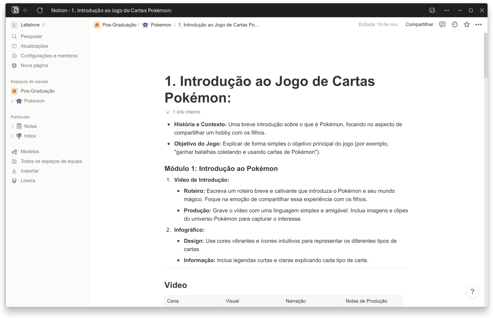
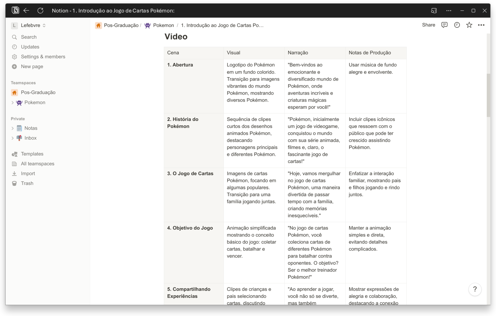
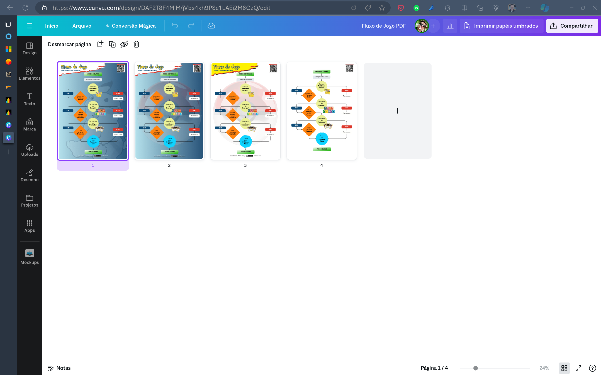
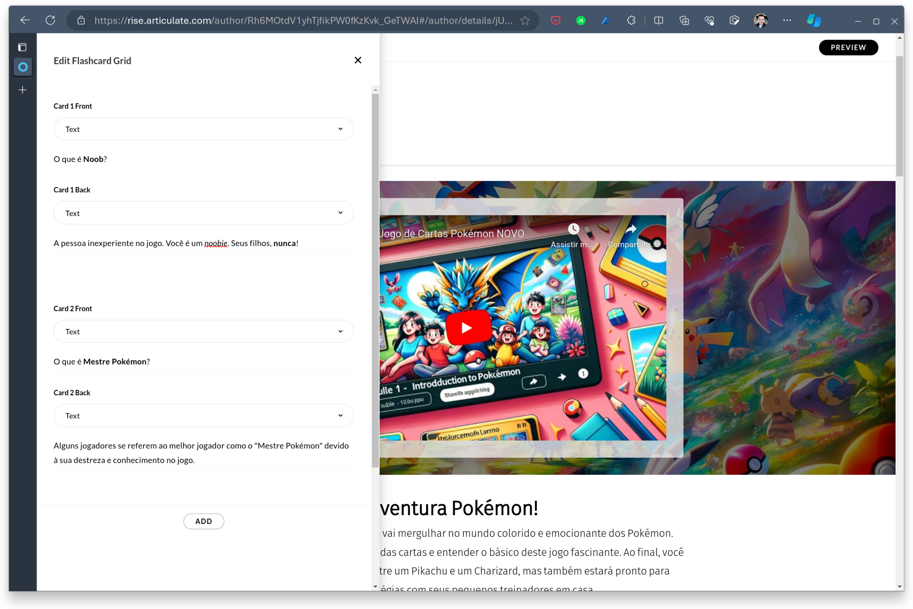





#  Projeto PokéPais
## Unindo Famílias Através do Jogo de Cartas Pokémon

Como muitos pais da minha geração, minha infância foi marcada por jogos de cartas clássicos, mas as cartas Pokémon eram como uma floresta inexplorada. Rapidamente percebi que não estava sozinho nesse caminho.

Encarar o desconhecido, seja ele intimidador ou empolgante, é como afiar uma nova ferramenta na oficina. Com esse espírito, mergulhamos no nosso projeto de laboratório de design instrucional. Tudo começou com um desafio pessoal: eu, um pai quarentão, buscando uma conexão com meu filho de 7 anos através do seu novo passatempo – jogar cartas Pokémon.






No projeto **PokéPais** é um curso interativo para ensinar pais e filhos a jogar o jogo de cartas Pokémon. O objetivo é fortalecer laços familiares através de uma experiência de aprendizado compartilhada e divertida. O projeto foi desenvolvido por Joyce Mello e Lefebvre Saboya para a pós-graduação em Design Instrucional do Senac sob a orientação da Professora Cristiane Sá.



- **Título**: PokéPais: Aventuras em Família com o Jogo de Cartas Pokémon
- **Data de Lançamento**: 18 de novembro de 2023
-  **Stakeholders**:
   - Alunos da Pós-Graduação em Design Instrucional.
   - Professora Cristiane Sá (Orientadora).
   - Famílias participantes como público-alvo.
- **Público-Alvo**: Pais na faixa etária de 30 a 40 anos, com conhecimento básico a intermediário de tecnologia e sem experiência prévia com jogos de cartas colecionáveis.
- **Ferramentas Utilizadas**: Articulate Rise 360, Notion, Zoom, Canva, Clipchamp.
  




<object data="/portfolio/pokepais/pos-projeto.pdf" type="application/pdf" width="700px" height="700px">
    <embed src="/portfolio/pokepais/pos-projeto.pdf">
        <p>This browser does not support PDFs. Please download the PDF to view it: <a href="/portfolio/pokepais/pos-projeto.pdf">Download PDF</a>.</p>
    </embed>
</object>

## Problema a Resolver: Criar um Curso Inovador para Pais Dominarem o Pokémon

Como muitos pais da minha geração, minha infância foi marcada por Super Trunfo e jogos de cartas clássicos, mas as cartas Pokémon eram como uma floresta inexplorada. Rapidamente percebi que não estava sozinho nesse caminho.

Numa reunião da pós-graduação em design instrucional, brotou a ideia de forjar um micro-learning para pais na mesma situação. O alvo era descomplicar as regras do Pokémon e torná-las tão claras quanto instruções de montagem de um bom móvel.

## Desenvolvimento: Transformando Desafios em Soluções Criativas no Projeto PokéPais

No desenvolvimento do projeto PokéPais, enfrentamos desafios comuns em muitos projetos de design instrucional: limitações de tempo e orçamento. No entanto, essas restrições se tornaram oportunidades para explorar soluções criativas e eficientes.

Devido às questões de direitos autorais com imagens Pokémon, a Professora Cristiane sugeriu a criação de personagens originais. Inspirado por isso, pedi ao meu filho que desenhasse e descrevesse novos personagens. Esses rascunhos foram a base para a criação de imagens por inteligência artificial, adaptando-os com base em descrições detalhadas.


## Pesquisa e Estruturação:

Começamos pesquisando as regras do jogo e formas de simplificá-las. Simultaneamente, desenvolvemos os módulos do curso, incluindo um vídeo de introdução para motivar os pais.

## Ferramentas de Trabalho:

Utilizamos o Notion para gerenciamento do projeto, permitindo colaboração assíncrona entre mim e Joyce Mello. O Canva foi essencial para o desenvolvimento gráfico, e o Zoom nos ajudou a estruturar o curso remotamente.



Cada módulo foi cuidadosamente criado para ensinar aos pais como ler as cartas, entender cada informação nelas e a dinâmica do jogo.





## Gravação de Vídeos

Sem a possibilidade de produzir gravações profissionais, recorremos ao ClipChamp, uma ferramenta prática com excelente funcionalidade de narração. Isso permitiu a rápida prototipagem dos vídeos do curso.

- Narração por Inteligência Artificial: Utilizamos a função de narração do ClipChamp para converter nossos scripts cuidadosamente elaborados em narrações claras e envolventes.
- Incorporação de Elementos Gráficos: Combinamos a narração com os elementos gráficos criados, buscando maximizar a atratividade e o impacto educacional dos vídeos.


## Uso do RISE 360

Após a finalização dos vídeos, migramos para o Articulate Rise 360. Aqui, aproveitamos as diversas funcionalidades da plataforma para estruturar os módulos do curso, integrando os vídeos e os elementos gráficos.



## Feedback e Ajustes Finais
Realizamos uma reunião de feedback com pais do nosso círculo social, buscando avaliações honestas e práticas. Suas sugestões, dúvidas e críticas foram essenciais para os ajustes finais do curso.

## Resultado Final:
O protótipo do curso apresenta módulos práticos para os pais começarem a aprender os conceitos básicos do jogo de cartas Pokémon. Incluímos também links para recursos adicionais para aqueles que desejam aprofundar seus conhecimentos.



## Reflexão e Lições Aprendidas:
Esse projeto foi uma jornada incrível de aprendizado e criatividade. Aprendemos sobre a importância da flexibilidade, do trabalho em equipe e como a tecnologia pode facilitar a criação de soluções educacionais inovadoras. Mais importante, mostrou-nos como o design instrucional pode ser uma ponte para conectar gerações.




### Você tem o direito de:

1. **Compartilhar** — copiar e redistribuir o material em qualquer suporte ou formato
2. **Adaptar** — remixar, transformar, e criar a partir do material
3. O licenciante não pode revogar estes direitos desde que você respeite os termos da licença.

### De acordo com os termos seguintes:

1. **Atribuição** — Você deve dar o [crédito apropriado ](https://creativecommons.org/licenses/by-nc-sa/4.0/deed.pt-br#ref-appropriate-credit), prover um link para a licença e [indicar se mudanças foram feitas ](https://creativecommons.org/licenses/by-nc-sa/4.0/deed.pt-br#ref-indicate-changes). Você deve fazê-lo em qualquer circunstância razoável, mas de nenhuma maneira que sugira que o licenciante apoia você ou o seu uso.
2. **NãoComercial** — Você não pode usar o material para [fins comerciais ](https://creativecommons.org/licenses/by-nc-sa/4.0/deed.pt-br#ref-commercial-purposes).
3. **CompartilhaIgual** — Se você remixar, transformar, ou criar a partir do material, tem de distribuir as suas contribuições sob a [mesma licença ](https://creativecommons.org/licenses/by-nc-sa/4.0/deed.pt-br#ref-same-license)que o original.
4. **Sem restrições adicionais** — Você não pode aplicar termos jurídicos ou [medidas de caráter tecnológico ](https://creativecommons.org/licenses/by-nc-sa/4.0/deed.pt-br#ref-technological-measures)que restrinjam legalmente outros de fazerem algo que a licença permita.

### Créditos:

```html
Criado por <a href="[xxxx](https://www.linkedin.com/in/jhmello82/)">Joyce Mello</a> e <a href="[xxxx](https://www.linkedin.com/in/llsaboya/)">Lefebvre Saboya</a>. Saiba mais sobre o projeto <a href="https://www.llsaboya.com/products/pokepais-pokemon/?utm_content=creditCopyText&utm_medium=referral&utm_source=llsaboya">PokéPais: Unindo Famílias Através do Jogo de Cartas Pokémon</a>
```

 

